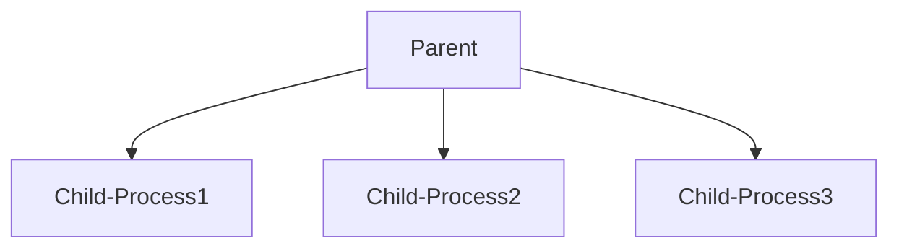
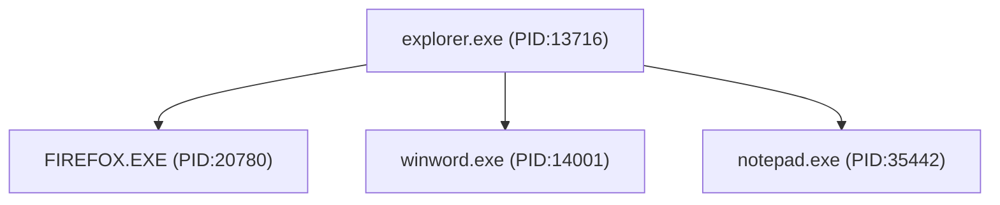

Process=Running Instances of Programs and applications executed by threads
- System (Windows) Processes
	- OS Core functions
	- System, smss.exe,csrss.exe
- User (Application) Processes
	- Initiated By User
	- Chrome.exe
- Service (Background) Processes
	- Background processes

**Process FlowChart**

Each of these child processes can be parent process as well

Process Hierachy is important in Investigations

*Note: .dll are files which are shared codes different programs can use instead of each programs having different codes to run*

**Windows Process Analysis**

Make sure the reverse shell is active for testing

- tasklist: shows all processes running in OS at the time.
	- Image name
	- PID
	- Session name
	- tasklist /V shows more verbose result
	- tasklist /M shows all .dll used for running services
	- tasklist /FI-> used for filters like "PID eq 3234" or "Imagename eq name"
	- Most .dll are specifically linked to malwares, we can also check the dynamaic-link library associated with process by
		- tasklist /FI /M "any Filter "

- wmic : Windows management Instrumentation command-line allow us to interact with wmi for managing devices and application and query management data
	- Identification of suspicious Process is necessary at this point
	- >wmic process where processid=123 get name, parentprocessid, processid: shows us the connection of specific process to his parent process which work as pivot

*Other Utilities that can help*
- find: work like grep in windows
- get command line:can show  one liner code attacker initiate for privilege escalation
- revshell.com: A reverse shell generator for command line invocation of process

# Windows Service Analysis

Windows Services are specific type of processes or programs that run in the background of the Windows operating system, without a user interface, to perform essential tasks and provide functionality to other programs like disk and network management.

Services are used by adversaries to gain persistence as well as Privilege  escalation

 - sc  is cli utility used to interact with services in windows 
	 - Allow us to create/start/stop/restart services
		 - sc create BackupService binPath="C:\User\Humayun\Downloads\Notwalware.exe"  start=auto
**Service Investigation**

- service.msc utility is Microsoft management console used to manage services
- net start cli utility: shows all active services in cli
- sc query state=all : shows every single service whether its running or not

After Identifying Malicious service
- sc qc 'servicename': query of service configuration that provide deatils like which executable service is pointing to and other controls